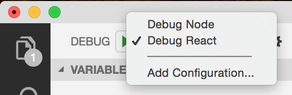

# Debugging Electron in VSCode

## This is my first shot at debugging an Electron App using VSCode

It ain't perfect, but it works :)
The dev environment currently requires the following workflow:

0. Install all dependencies
```
npm install
```

1. Start React-dev server
```
npm start:client
```
2. Start the debug session, either for debugging the backend, by selecting "Debug Node" or the frontend, by selecting "Debug React", then click on the green arrow, or hit "F5".


3. Set breakpoints and catch your code.

Note, this is a first shot at the project. Would be great to create a hybrid process where the main.js and external files server through create-react-app could be debugged together, like [this](https://medium.com/@auchenberg/introducing-simultaneous-nirvana-javascript-debugging-for-node-js-and-chrome-in-vs-code-d898a4011ab1).

VSCode debugging launch.json details inspired from [here](https://www.youtube.com/watch?v=nuZIeJ0ljgo).
